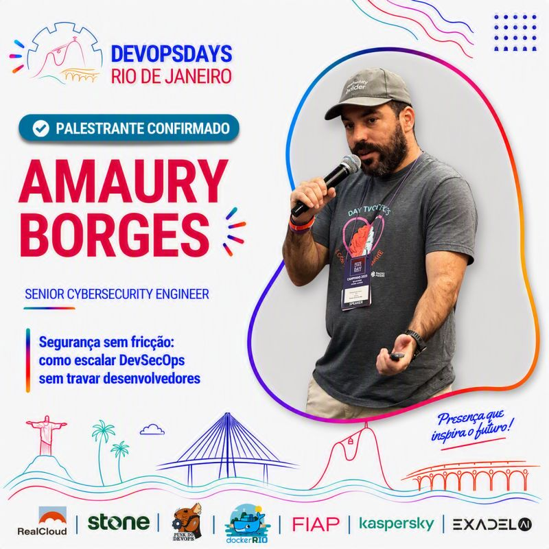
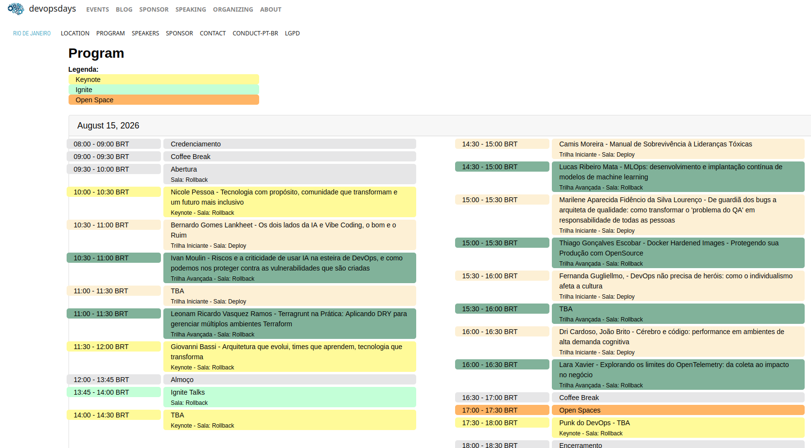

## 🎤Palestra
🚨 PALESTRANTE CONFIRMADO! 🚨

Temos o prazer de anunciar que [Amaury Borges Souza](https://www.linkedin.com/in/amaurybsouza/), nosso Senior Cybersecurity Engineer, estará no palco do DevOpsDays Rio de Janeiro! 

Prepare-se para uma palestra imperdível sobre "Segurança sem fricção: como escalar DevSecOps sem travar desenvolvedores". Amaury trará insights valiosos sobre como integrar segurança de forma eficiente, garantindo que o desenvolvimento continue ágil e sem obstáculos. 

Apaixonado por promover a segurança desde o início do desenvolvimento em larga escala por meio de automação de linha de comando (CLI), mecanismos de proteção automatizados e capacitação de desenvolvedores com IA no ciclo de vida de desenvolvimento de software (SDLC). 

Além disso, ele é professor na FIAP, onde leciona em programas de MBA Tech e inspira a próxima geração de líderes tecnológicos
Não perca a chance de aprender com um dos maiores especialistas da área e descobrir as melhores práticas para um DevSecOps de sucesso!

🗓️ Fique ligado para mais informações sobre o evento e a programação completa!

**Título**

*AI-Assisted DevSecOps: Construindo Pipelines Inteligentes com Agentes de IA*

**Evento**

[DevOpsDays Rio de Janeiro 2026](https://devopsdays.org/events/2026-rio-de-janeiro/welcome/)

**Palestrante**

[Amaury Borges Souza](https://www.linkedin.com/in/amaurybsouza/)

---

## Sobre a palestra

Nesta apresentação demonstro como agentes de IA podem apoiar pipelines modernos de DevSecOps, utilizando análise contextual, Skills especializadas e ferramentas tradicionais de segurança para reduzir ruído, priorizar vulnerabilidades e melhorar a experiência do desenvolvedor.

Durante a sessão são apresentados exemplos práticos utilizando GitHub Actions, Claude Code, Trivy, Terraform e Docker.

Na palestra “10 Verificações Rápidas para Saber se Sua Conta AWS Está Realmente Segura”, ele apresenta um checklist prático usado nos primeiros minutos ao acessar uma conta AWS — focado em identificar rapidamente o nível real de maturidade de segurança.

    📅 25 de março
    ⏰ 19h às 22h
    📍 FIAP – R. Marquês de Olinda, 11, Botafogo – RJ
    🔗 Site do evento: https://hackinbrasil.com.br/meetup-25-03-2026/
    🎟 Ingressos: https://hackinbrasil.com.br/meetup-25-03-2026/

